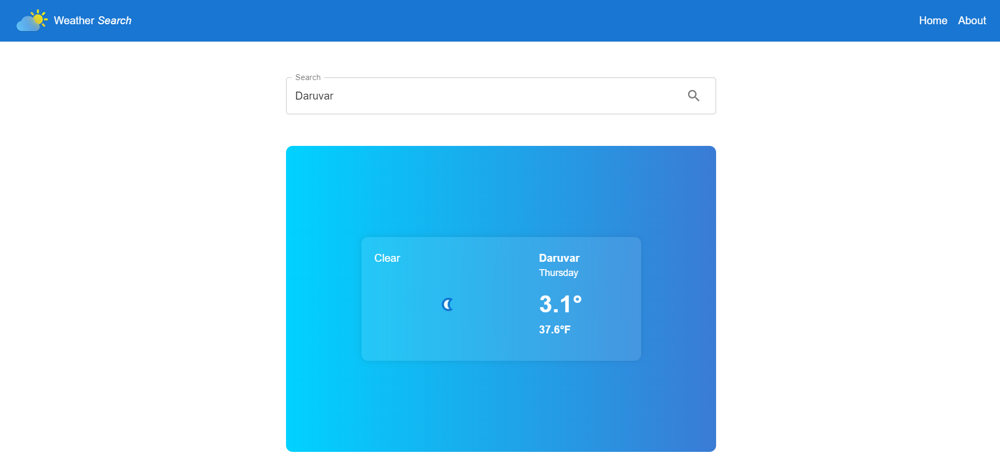

# WeatherWonder

WeatherWonder is simple weather application to show how each parts of React application work. It can also be used to simply see current weather data of any city in the world.


## Screenshots



## Tech Stack

**Client:** React, Redux, MUI, Axios, API (weatherapi.com)
 - [React](https://react.dev/)
 - [Redux-Toolkit](https://redux-toolkit.js.org/)
 - [MUI](https://mui.com/)
 - [Axios](https://axios-http.com/docs/intro)
 - [API](https://www.weatherapi.com/)


## Run Locally

Clone the project

```bash
  git clone https://link-to-project
```

Go to the project directory

```bash
  cd my-project
```

Install package dependencies

```bash
  npm ci
```

Start the server

```bash
  npm run dev-server
```


## Acknowledgements

 - [Weather API](https://www.weatherapi.com/)

